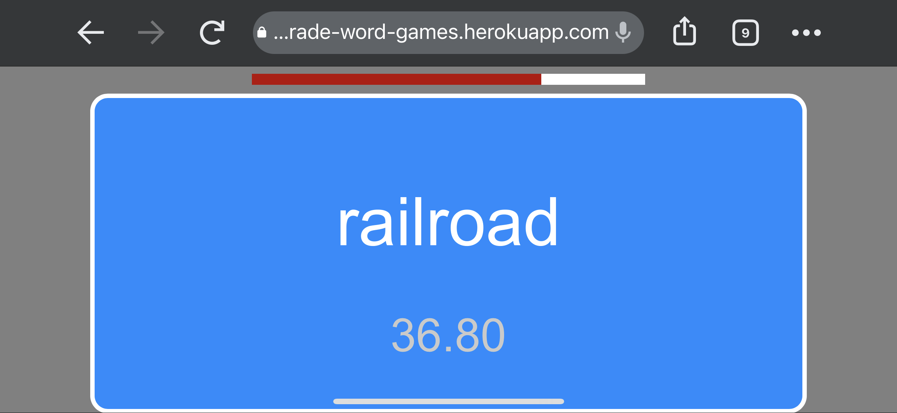
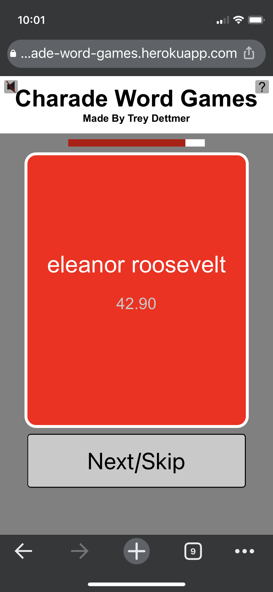
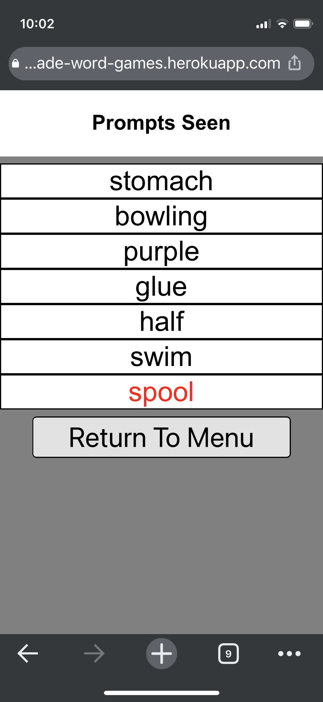

# Charade-Word-Games
## Try it out at https://treydettmer.github.io/Charade-Word-Games/
### Summary
This is my first web application built using the popular ReactJS framework. My friends and I love to play the Catch Phrase and Heads Up party games, so I figured making online versions of those games would be a fun project for my first ReactJS app. One of the major tasks involved with the development of this app was finding hundreds of prompts for each game category (currently the categories are Easy, Medium, Hard, Entertainment, People and Characters, Travel, Household, Food, Music, Holiday Words, and Everything). This process involved using Python to scrape webpages that contained lists of prompts, then writing the unique prompts into text files which are separated by category.

### When trying the app, keep in mind that the Heads Up game will only work on mobile devices. Reference the help page (the question mark icon in the top right of the app's webpage) to help solve any problem that you may face with the app.

## Screenshots

